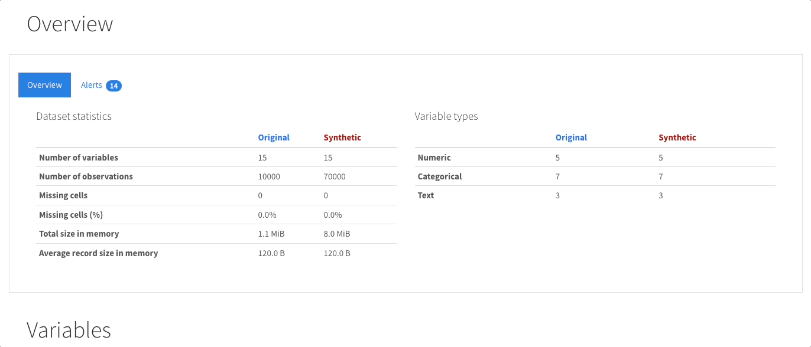

# Data Profiling con Registro de Conectores

Proyecto para generar reportes **EDA (Exploratory Data Analysis)** con `ydata-profiling` (entrypoint por defecto) y `dataprep.eda` (entrypoint alterno), mas una capa de conectores extensible con validacion de esquema, fabrica y metadatos para UI.



## Que se implemento

- Registro central (`ConnectorRegistry`) con taxonomia y orden deterministico.
- Modelo `ConnectorSpec` con campos: `id`, `group`, `label`, `type`, `driver/provider/service`, `required_fields`, `optional_fields`.
- Fabrica `create_connector(connector_id, config)`.
- Interfaz comun por conector:
  - `connect()`
  - `read(query_or_path, **kwargs)`
  - `test_connection()`
- Esquema de configuracion con:
  - `connectors.default`
  - `connectors.catalog`
  - `connectors.groups`
- Metadatos de UI agrupados por orden con `get_grouped_connector_options()`.

## Taxonomia y orden

1. `file`
   - `csv` (CSV)
   - `json` (JSON)
2. `databases` (transactional)
   - `postgres` (Postgres)
   - `mysql` (MySQL)
   - `mariadb` (MariaDB)
   - `sql-server` (SQL Server)
   - `oracle` (Oracle)
   - `mongodb` (MongoDB)
3. `cloud_warehouses`
   - `gcp-bigquery` (GCP BigQuery)
   - `aws-redshift` (AWS Redshift)
   - `azure-synapse` (Azure Synapse)
   - `snowflake` (Snowflake)

## Estructura

```text
.
|-- main.py
|-- main_ydata.py
|-- main_dataprep.py
|-- requirements_ydata.txt
|-- requirements_dataprep.txt
|-- input/
|   |-- csv_files/
|   `-- sql_files/
|-- output/
|   |-- dataprep/
|   `-- ydata/
|-- data_profiling/
|   |-- __init__.py
|   `-- connectors.py
|-- config_examples/
|   `-- connectors.example.yaml
|-- docs/
|   `-- config-schema.md
`-- tests/
    |-- test_connector_registry.py
    `-- test_connector_connections.py
```

## Entornos recomendados

`ydata-profiling` (recomendado para `main.py` y `main_ydata.py`):
Python recomendado: 3.10.11.

```powershell
python -m venv .venv_ydata
.\.venv_ydata\Scripts\Activate.ps1
pip install -r requirements_ydata.txt
```

`dataprep` (para `main_dataprep.py`, stack mas legacy):
Python recomendado: 3.9.13

```powershell
python -m venv .venv_dataprep
.\.venv_dataprep\Scripts\Activate.ps1
pip install -r requirements_dataprep.txt
```

Para pruebas en cualquiera de los entornos:

```powershell
pip install .[test]
pytest
```

Ejecucion principal (ydata-profiling):

```powershell
python main.py
```

Seleccion de motor en `main.py`:
- Edita la variable `ENGINE` al final del archivo con `ydata` o `dataprep`.

Ejecucion con DataPrep:

```powershell
python main_dataprep.py
```

Variables de entorno soportadas por `main.py`:

```dotenv
DATA_SOURCE=csv|json|gcp-bigquery
FILE_NAME=diamonds_sample.csv
GCP_PROJECT_ID=tu-proyecto-gcp
GCP_DATASET=dataset_opcional
GCP_CREDENTIALS_PATH=/ruta/a/service-account.json
GCP_LOCATION=US
```

Rutas de IO:

- `csv/json` leen desde `input/csv_files/<FILE_NAME>`.
- `gcp-bigquery` lee el SQL desde `input/sql_files/<FILE_NAME>`.
- `main_dataprep.py` escribe en `output/dataprep/<file_name>_profiling.html`.
- `main_ydata.py` escribe en `output/ydata/<file_name>_profiling.html`.

## Esquema de configuracion

Config minima:

```yaml
connectors:
  default: csv
  catalog: {}
  groups: {}
```

Ejemplo completo:

- `config_examples/connectors.example.yaml`

Referencia corta:

- `docs/config-schema.md`

## Dependencias opcionales por conector

Instala extras segun el conector que uses:

- Postgres: `pip install .[postgres]`
- MySQL: `pip install .[mysql]`
- MariaDB: `pip install .[mariadb]`
- SQL Server: `pip install .[sqlserver]`
- Oracle: `pip install .[oracle]`
- MongoDB: `pip install .[mongodb]`
- BigQuery: `pip install .[bigquery]`
- Redshift: `pip install .[redshift]`
- Synapse: `pip install .[synapse]`
- Snowflake: `pip install .[snowflake]`

Los imports son lazy: si falta una dependencia, se lanza un error claro indicando el extra a instalar.
